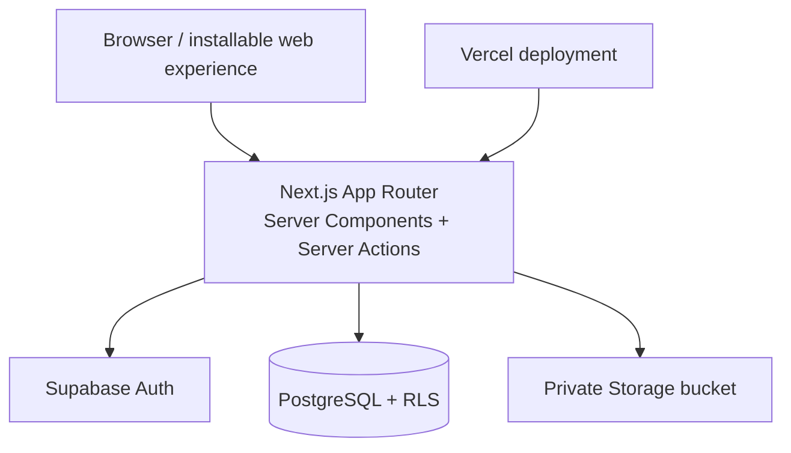

# Doggy World 🐾

Doggy World is an open-source experiment exploring a digital ecosystem centered on each dog's persistent identity. The v0.1 MVP is a mobile-first web application where owners create polished Doggy Passports, record structured preferences and product feedback, connect dogs as friends, and share public profiles by link or QR code.

The dog—not the account—is the central product entity. New capabilities can build on the same `dog_id` without moving core data into opaque JSON or rebuilding identity later.

## Current MVP

- Email/password sign-up, sign-in, session refresh, and sign-out.
- Automatic owner profiles with editable public-facing basics.
- Multiple Doggy Passports per owner, including private image uploads.
- Structured personality, preference, and profile-completeness data.
- Seeded product catalog with category-aware dog feedback.
- Symmetric dog friendships with request, accept, decline, block, and remove flows.
- Public, privacy-limited dog profiles with canonical share links and QR codes.
- Responsive dashboard, discovery, account settings, PWA metadata, and a clearly labeled demo mode.
- PostgreSQL constraints, Row Level Security (RLS), storage policies, pgTAP contracts, and component/unit tests.

## Architecture



```text
Auth user
└── Owner profile
    └── Dog
        ├── Preferences
        ├── Product interactions
        ├── Public passport / QR
        └── Friendships ↔ Dog
```

The application defaults to Server Components. Interactive forms and sharing controls are small Client Components. All mutations run in Server Actions, authenticate again at the mutation boundary, validate with Zod, and remain subject to database RLS.

## Technology

- Next.js 16 App Router, React 19, TypeScript
- Tailwind CSS 4
- Supabase Auth, PostgreSQL, and Storage
- Zod validation
- Vitest and Testing Library
- Supabase CLI and pgTAP
- Vercel-ready deployment configuration

## Quick start: interface demo

This mode needs no credentials and never claims to persist changes. It is useful for reviewing the complete responsive interface and seeded content.

```bash
git clone <repository-url>
cd DoggyWorld
npm ci
npm run dev
```

Open [http://localhost:3000](http://localhost:3000). A visible banner identifies demo mode. Read-only pages use synthetic data; mutations explain that Supabase configuration is required.

## Full local development

### Prerequisites

- Node.js 20.9 or newer
- npm (the committed lockfile is authoritative)
- Docker Desktop or another Docker-compatible engine

Install dependencies:

```bash
npm ci
```

Start the local Supabase stack, apply migrations, and load the seed:

```bash
npm run db:start
npm run db:reset
```

Copy `.env.example` to `.env.local`, then use the API URL and anon key printed by `npm run db:start`:

```dotenv
NEXT_PUBLIC_SUPABASE_URL=http://127.0.0.1:54321
NEXT_PUBLIC_SUPABASE_ANON_KEY=<local-anon-key>
NEXT_PUBLIC_SITE_URL=http://localhost:3000
```

Start the application:

```bash
npm run dev
```

The local seed includes two synthetic accounts for exercising the complete friendship journey:

| Account | Password | Seeded dogs |
| --- | --- | --- |
| `demo.owner@example.test` | `DoggyDemo!2026` | Rocky, Luna |
| `demo.friend@example.test` | `DoggyDemo!2026` | Coco, Milo |

These credentials are development fixtures. Never reuse them for a real account or include this demo-user seed in a production database.

Stop the local services when finished:

```bash
npm run db:stop
```

## Hosted Supabase setup

1. Create a Supabase project.
2. Authenticate and link the CLI:

   ```bash
   npx supabase login
   npx supabase link --project-ref <project-ref>
   ```

3. Preview and apply the migrations:

   ```bash
   npx supabase db push --linked --dry-run
   npx supabase db push --linked
   ```

4. For a non-production demo project only, load the synthetic seed with:

   ```bash
   npx supabase db push --linked --include-seed
   ```

5. Add the hosted project URL and browser-safe anon key to `.env.local`.
6. In Supabase Auth URL configuration, set the site URL to the deployed origin and allow `<origin>/auth/callback`.

The application does not require a service-role key. Ordinary operations use the authenticated user session and RLS.

## Deploy to Vercel

1. Import the repository into Vercel.
2. Add `NEXT_PUBLIC_SUPABASE_URL`, `NEXT_PUBLIC_SUPABASE_ANON_KEY`, and `NEXT_PUBLIC_SITE_URL` to the desired environments.
3. Set `NEXT_PUBLIC_SITE_URL` to the canonical HTTPS origin so shared links and QR codes never encode localhost.
4. Deploy, then add `https://<your-domain>/auth/callback` to the Supabase redirect allow-list.

Run migrations separately through the Supabase CLI; a web deployment must not mutate the database schema during build.

## Database model

| Table | Purpose | Important rules |
| --- | --- | --- |
| `profiles` | One owner profile per Auth user | Primary key references `auth.users`; owner-only access |
| `dogs` | Persistent Doggy Passport | UUID identity, unique slug, one MVP owner, public-or-owner reads |
| `dog_preferences` | Queryable likes, dislikes, and traits | Typed category/key/value rows; unique key per dog/category |
| `products` | Non-commerce catalog foundation | Typed category and optional analyzable product traits |
| `dog_product_interactions` | Structured product reaction | One interaction per dog/product; owner-only mutations |
| `dog_friendships` | Dog-to-dog relationship | Canonical unordered pair, no self-link, controlled transitions |

The initial migration also creates:

- UUID and update-time helpers.
- A profile-creation trigger for new Auth users.
- Foreign keys, cascades, enum domains, checks, and query indexes.
- RLS on every application table.
- A narrow public-favorites function that exposes only approved product fields.
- A private `dog-photos` bucket with owner-folder writes and public-dog reads.

### Privacy boundaries

Public passport queries return only dog profile fields, explicitly public preferences, public friends, and selected favorite product metadata. They do not expose owner email, account data, exact addresses, product notes, private preferences, or private feedback. Location is city/country only in v0.1.

Application ownership checks improve error messages, but authorization does not depend on them: database and storage policies enforce the same boundaries.

## Routes

| Route | Purpose |
| --- | --- |
| `/` | Product landing page |
| `/login`, `/sign-up` | Authentication |
| `/dashboard` | Owner home and dog management |
| `/dogs/new`, `/dogs/[id]`, `/dogs/[id]/edit` | Passport creation and management |
| `/dogs/[id]/products` | Dog-specific product feedback |
| `/dogs/[id]/friends`, `/friend-requests` | Friendship management |
| `/dog/[slug]` | Public Doggy Passport and sharing |
| `/products`, `/products/[id]` | Catalog and product detail |
| `/discover` | Public dog discovery |
| `/settings` | Owner profile settings |

## Verification

```bash
npm run lint
npm run typecheck
npm run test
npm run build
npm run db:test       # requires the local Supabase stack
npm run verify        # frontend checks together
```

Frontend tests cover validation, slug/age/completeness utilities, schema contracts, critical passport fields, and contextual product-feedback questions. The pgTAP suite covers table and key relationships, self-friendship rejection, owner profile visibility, owned dogs, and private interaction isolation.

## Project structure

```text
src/
├── app/                 # Routes, metadata, Server Actions, auth callback
├── components/          # Dog, product, friend, sharing, layout, and UI components
├── lib/
│   ├── data/            # Server-only data access layer
│   ├── i18n/            # Central Spanish labels ready for expansion
│   └── supabase/        # Browser/server/proxy clients
└── types/               # Database and view-model types
supabase/
├── migrations/          # Versioned schema, constraints, RLS, storage policies
├── tests/               # pgTAP database contracts
├── config.toml          # Reproducible local stack
└── seed.sql             # Synthetic users, dogs, products, and interactions
tests/                   # Unit and component tests
```

## Known v0.1 limitations

- A dog has one owner; multi-owner households are deferred.
- Public discovery is global and does not use coordinates or nearby matching.
- Product catalog administration and commerce are intentionally absent.
- Friendship and feedback updates are request/response based; realtime notifications are not enabled.
- The QR is rendered for sharing but not exported as a downloadable image yet.
- Image upload accepts JPG, PNG, or WebP up to 3 MB; advanced cropping is deferred.
- Local pgTAP execution requires a running Docker engine.

## Future direction

Focused later modules may include approximate nearby discovery, playdates, service providers, commerce, health history, realtime messaging, and contextual assistance. These are roadmap directions, not advertised as working features in the current interface.

### Visual design integration

The current UI is a functional, responsive, accessible shell. **Lovable is the visual source of truth** for the future landing page and design system in [`VicenteBarrientos/doggy-world-design-system`](https://github.com/VicenteBarrientos/doggy-world-design-system).

Future integration should reuse that repository's tokens and presentational components while preserving this repository's domain types, data layer, Server Actions, authentication, Supabase schema, RLS policies, and tests. Working backend behavior should not be rebuilt solely to adopt the visual design.

## Contributing

See [CONTRIBUTING.md](CONTRIBUTING.md) for the development workflow and [SECURITY.md](SECURITY.md) for responsible vulnerability reporting. By contributing, you agree that your work is released under the repository license.

## License

MIT — see [LICENSE](LICENSE).
